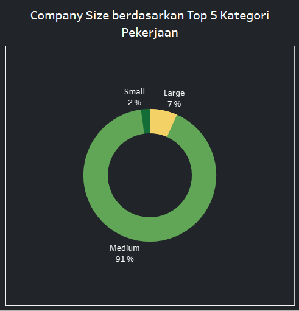

# Analisis Pasar Kerja dalam Industri Data: Pandangan Mendalam untuk Rekrutmen dan Pengembangan Organisasi

## Latar Belakang / Problems
Sebuah badan riset kerja memiliki kebutuhan data terkait pekerjaan yang sangat dibutuhkan oleh perusahaan-perusahaan di bidang data. Dalam konteks ini, tim analis data melakukan penelitian menyeluruh yang mencakup sejumlah variabel krusial seperti struktur gaji, lingkungan kerja, skala perusahaan, jenis pekerjaan, tingkat pengalaman, lokasi tempat tinggal karyawan, dan kategori pekerjaan.

## Target / Objective
Adapun target/objective yang menjadi acuan pada kasus ini yaitu:
    
    1. Mengidentifikasi jenis pekerjaan yang paling diminati di industri data.
    2. Menganalisis tren struktur gaji dalam industri data berdasarkan standar kompensasi (median).
    3. Memperoleh pemahaman tentang tingkat pengalaman yang umumnya dibutuhkan dalam bidang yang paling diminati.
    4. Mengevaluasi lokasi tempat tinggal karyawan yang paling sesuai dengan kebutuhan operasional.
    5. Menganalisis tentang skala perusahaan berdasarkan kategori pekerjaan.

## Tujuan / Goals
Tujuan utama dari analisis ini adalah memberikan rekomendasi kepada manajemen perusahaan yang berencana merekrut atau membuat divisi yang fokus pada data. Rekomendasi ini didasarkan pada pemahaman mendalam tentang pasar kerja dan kebutuhan organisasi, mempertimbangkan berbagai aspek yang relevan.

## Dataset
Dataset ini menyajikan informasi terbaru untuk tahun 2024 yang berkaitan dengan Pekerjaan dan Gaji dalam bidang Ilmu Data. Data ini berasal dari sumber terpercaya, yaitu Kaggle, dan dapat diakses melalui tautan berikut: Jobs and Salaries in Data Field 2024. Dataset ini terdiri dari 12 kolom dan mencakup 14200 baris data, dengan setiap kolom memiliki informasi berikut:

work_year: Tahun ketika data tersebut dicatat. Aspek ini mengindikasikan konteks waktu dari data, yang sangat penting untuk memahami pola tren gaji dari waktu ke waktu.

job_title: Judul yang spesifik dari pekerjaan, seperti 'Data Scientist', 'Data Engineer', atau 'Data Analyst'. Informasi ini menjadi kunci untuk memahami sebaran gaji pada berbagai peran khusus dalam bidang data..

job_category: Mengelompokkan peran pekerjaan ke dalam kategori yang lebih umum untuk memudahkan analisis. Ini bisa meliputi bidang seperti 'Data Analysis', 'Machine Learning', 'Data Engineering', dll.

salary_currency: Mata uang dalam pembayaran gaji, misalnya USD, EUR, dan sebagainya. Informasi ini krusial untuk konversi mata uang dan pemahaman nilai gaji yang sebenarnya dalam konteks global.

salary: Gaji kotor tahunan dari peran tersebut dalam mata uang lokal. Angka gaji mentah ini penting untuk perbandingan gaji regional langsung.

salary_in_usd: Pendapatan tahunan yang telah dikonversi menjadi Dolar Amerika Serikat (USD). Konversi mata uang yang seragam ini membantu dalam perbandingan dan analisis gaji secara global.

employee_residence: Negara tempat tinggal karyawan tersebut. Data ini dapat digunakan untuk mengeksplorasi perbedaan gaji geografis dan variasi biaya hidup.

experience_level: Klasifikasi tingkat pengalaman profesional karyawan. Kategori umumnya mungkin termasuk 'Entry-level', 'Mid-level', 'Senior', dan 'Executive', memberikan wawasan tentang bagaimana pengalaman mempengaruhi gaji dalam peran terkait data.

employment_type: Menentukan jenis pekerjaan, seperti 'Full-time', 'Part-time', 'Contract', dan lainnya. Informasi ini membantu dalam menganalisis bagaimana pengaturan pekerjaan yang berbeda mempengaruhi struktur gaji.
work_setting: Pengaturan atau lingkungan kerja, seperti 'Remote', 'In-person', or 'Hybrid'. Kolom ini mencerminkan dampak pengaturan kerja terhadap tingkat gaji dalam industri data.

company_location: Negara tempat perusahaan tersebut berlokasi. Data ini membantu dalam menganalisis bagaimana lokasi perusahaan mempengaruhi struktur gaji.

company_size: Ukuran perusahaan tempat karyawan bekerja, sering kali dikategorikan menjadi small (S), medium (M), dan large (L). Ini memungkinkan untuk analisis bagaimana ukuran perusahaan mempengaruhi gaji.

## Analisis / analysis

1. Mengidentifikasi jenis pekerjaan yang paling diminati di industri data.

Analisis tersebut menampilkan lima kategori pekerjaan teratas dalam industri data dari berbagai kategori yang ada. Dari visualisasi data yang disajikan, dapat disimpulkan bahwa 'Data Science and Research' menduduki peringkat tertinggi dengan jumlah pekerja mencapai 894, disusul oleh 'Data Engineering' dengan 487 pekerja, dan 'Machine Learning and AI' dengan 441 pekerja. Walaupun hanya mempertimbangkan lima kategori pekerjaan utama, terdapat perbedaan yang cukup signifikan dalam jumlah pekerjaan antara yang tertinggi 'Data Science and Research' dan yang terendah 'Leadership and Management'. 

2. Menganalisis tren struktur gaji dalam industri data berdasarkan standar kompensasi (median).

Dari lima kategori teratas yang telah diidentifikasi sebelumnya, dilakukan analisis rata-rata gaji berdasarkan tingkat pengalaman. Tingkat pengalaman dipilih sebagai variabel acuan karena analisis data menggunakan matriks korelasi dengan metode spearman menunjukkan bahwa tingkat pengalaman memiliki hubungan yang paling tinggi dengan gaji, meskipun dengan nilai 0,41 yang masih termasuk dalam kategori hubungan rendah.

Kemudian, berdasarkan lima kategori pekerjaan dan tingkat pengalaman, dilakukan analisis terhadap rata-rata gaji pada tahun 2024 menggunakan median. Ditemukan bahwa dari lima kategori pekerjaan tersebut, kategori 'Machine Learning and AI' menunjukkan rata-rata gaji tertinggi pada posisi 'Executive' sebesar $228,500 dan rata-rata gaji terendah pada posisi 'Entry-level' sebesar $125,000. Sementara itu, pada kategori 'Data Science and Research', rata-rata gaji tertinggi juga terdapat pada posisi 'Executive' sebesar $190,250 dan rata-rata gaji terendah pada posisi 'Entry-level' sebesar $90,000. Namun, kategori 'Data Analysis' menunjukkan rata-rata gaji terendah, dengan rata-rata gaji tertinggi pada posisi 'Senior' sebesar $122,500 dan rata-rata gaji terendah pada posisi 'Entry-level' sebesar $84,553. Meskipun 'Data Science and Research' menduduki peringkat pertama dalam jumlah pekerja, namun dari segi rata-rata gaji, kategori 'Machine Learning and AI' menempati posisi pertama.

3. Memperoleh pemahaman tentang tingkat pengalaman yang umumnya dibutuhkan dalam bidang yang paling diminati.

Selanjutnya, berdasarkan lima kategori pekerjaan tersebut, dilakukan analisis terhadap distribusi tingkat pengalaman. Hasilnya menunjukkan bahwa tingkat pengalaman 'Senior' memiliki distribusi tertinggi, sekitar 54%, diikuti oleh 'Mid-level', dan distribusi terendah terdapat pada posisi 'Executive', sekitar 4%.

4. Mengevaluasi lokasi tempat tinggal karyawan yang paling sesuai dengan kebutuhan operasional.

Untuk mengevaluasi lokasi tempat tinggal karyawan, dilakukan analisis persebaran menggunakan peta. Hasil analisis menunjukkan bahwa persebarannya cukup luas, dengan banyak karyawan tersebar di berbagai wilayah.

Karena persebarannya cukup luas, dilakukan analisis untuk mencari lima negara teratas. Dari hasil analisis, ditemukan bahwa Amerika Serikat menduduki peringkat pertama dengan total 2,375 pekerja dan disusul oleh Canada dengan total 119 pekerja. Meskipun menggunakan lima negara teratas, namun hasil visualisasi masih menunjukkan ketidakseimbangan dalam persebarannya dan cukup bias.

5. Menganalisis tentang skala perusahaan berdasarkan kategori pekerjaan.

Kemudian dilakukan analisis terhadap skala perusahaan berdasarkan lima kategori pekerjaan teratas. Hasil visualisasi menunjukkan distribusi yang tidak merata, di mana perusahaan skala 'medium' mendominasi sebesar 91% dari total pekerjaan. Sementara itu, perusahaan skala 'small' hanya menyumbang sebesar 2%, yang merupakan jumlah terendah dalam distribusi tersebut.

## Stakeholder
Stakeholder yang relevan dalam kasus ini dapat meliputi:

1. Manajemen Perusahaan: Mereka memiliki kepentingan dalam memahami tren pasar kerja dan kebutuhan organisasi untuk merekrut dan mengembangkan divisi atau tim yang fokus pada data. Analisis ini akan membantu mereka dalam membuat keputusan strategis terkait rekrutmen dan pengembangan sumber daya manusia.

2. Tim HR (Sumber Daya Manusia): Mereka bertanggung jawab dalam merencanakan, merekrut, dan mengelola karyawan. Analisis pasar kerja ini akan membantu mereka dalam menyusun strategi rekrutmen yang efektif, menyesuaikan kebijakan kompensasi, dan mengevaluasi kebutuhan pengembangan karyawan.

3. Analis Data dan Ilmuwan Data: Mereka merupakan pemangku kepentingan utama dalam mengeksplorasi data dan mengekstrak wawasan yang berharga dari dataset yang diberikan. Informasi tentang tren pekerjaan dan struktur gaji akan membantu mereka dalam merencanakan karier dan mengambil keputusan yang tepat terkait pengembangan keterampilan.

4. Karyawan atau Calon Karyawan: Mereka memiliki kepentingan dalam memahami tren pasar kerja untuk menentukan jalur karir yang tepat dan menilai nilai gaji yang kompetitif dalam industri data.

5. Pihak Eksternal: Stakeholder eksternal seperti lembaga pendidikan dan pelatihan juga dapat tertarik untuk memahami kebutuhan pasar kerja dalam industri data guna menyusun program pendidikan atau pelatihan yang relevan.

## Rekomendasi / Recommendation
Berikut beberapa rekomendasi yang dapat kami sarankan berdasarkan stakeholder yang relevan dalam kasus ini:

1. Manajemen Perusahaan:
- Menyesuaikan kebijakan gaji dengan tingkat pengalaman dan kategori pekerjaan untuk memastikan kompensasi yang adil dan mempertahankan karyawan berkinerja tinggi.
- Menganalisis persebaran lokasi karyawan untuk memahami potensi dampaknya terhadap operasional perusahaan dan menyesuaikan strategi manajemen sumber daya manusia yang sesuai.
2. Tim HR (Sumber Daya Manusia):
- Menyesuaikan kebijakan gaji dengan tingkat pengalaman dan kategori pekerjaan untuk memastikan kompensasi yang kompetitif dan dapat mempertahankan dan menarik bakat terbaik.
- Menganalisis persebaran lokasi karyawan dan mempertimbangkan kebijakan fleksibilitas kerja atau lokasi untuk meningkatkan kesejahteraan karyawan dan produktivitas.
3. Analis Data, Ilmuwan Data dan Karyawan atau Calon Karyawan:
- Mengembangkan keterampilan dalam bidang 'Machine Learning and AI' untuk memanfaatkan peluang karier yang lebih besar dan kompensasi yang lebih tinggi.
- Memahami tren gaji berdasarkan tingkat pengalaman dan kategori pekerjaan untuk merencanakan pengembangan karier yang lebih baik dan menetapkan harapan yang realistis terkait kompensasi.
- Menggunakan pemahaman tentang distribusi tingkat pengalaman untuk merencanakan jangka panjang karir dan pengembangan keterampilan yang sesuai.
4. Pihak Eksternal:
- Memanfaatkan informasi tentang tren pekerjaan paling diminati dalam industri data untuk merancang program pelatihan atau pendidikan yang sesuai dengan kebutuhan pasar.
- Memahami tren gaji dan distribusi tingkat pengalaman untuk memberikan saran kepada klien atau mitra bisnis tentang kebijakan rekrutmen atau pengembangan tenaga kerja.

## Kesimpulan / Conclusion
Berdasarkan analisis yang dilakukan terhadap tren pekerjaan paling diminati, struktur gaji, distribusi tingkat pengalaman, lokasi tempat tinggal karyawan, dan skala perusahaan dalam industri data diatas dapat disimpulkan bahwa dalam industri data, pekerjaan yang paling diminati adalah 'Data Science and Research'. Struktur gaji berdasarkan tingkat pengalaman menunjukkan bahwa 'Machine Learning and AI' merupakan kategori pekerjaan dengan rata-rata gaji tertinggi, sementara 'Data Analysis' memiliki rata-rata gaji terendah. Distribusi tingkat pengalaman didominasi oleh tingkat 'Senior', yang memiliki implikasi signifikan dalam pengembangan karier dan kebijakan kompensasi. Meskipun demikian, lokasi tempat tinggal karyawan tersebar luas, dengan Amerika Serikat menjadi negara dengan jumlah karyawan terbanyak, tetapi terdapat ketidakseimbangan dalam distribusinya. Selain itu, skala perusahaan cenderung didominasi oleh perusahaan skala 'medium', yang mempengaruhi strategi operasional dan rekrutmen perusahaan.

## Disclaimer
`
Artikel ini dibuat sebagai bagian dari upaya untuk menyelesaikan Projek Pacmann tentang Data Visualisasi. Tujuan dari projek ini adalah untuk mendapatkan pemahaman yang mendalam tentang tren dan praktik terkini dalam visualisasi data, khususnya dalam konteks industri data yang terus berkembang. Artikel ini disusun berdasarkan analisis dan interpretasi data yang tersedia pada saat penulisan. Meskipun kami berusaha untuk menyajikan informasi yang akurat dan terpercaya, penulis tidak menjamin keakuratan atau kelengkapan informasi yang disajikan dalam artikel ini. Selain itu, informasi yang disampaikan dalam artikel ini bersifat umum dan tidak dimaksudkan sebagai saran atau rekomendasi profesional. Pembaca disarankan untuk melakukan penelitian tambahan atau berkonsultasi dengan ahli yang berkualifikasi sebelum mengambil keputusan berdasarkan informasi dalam artikel ini.
`

Link:

Dataset: [Link Kaggle](https://www.kaggle.com/datasets/murilozangari/jobs-and-salaries-in-data-field-2024)

Github: [Link Github](https://github.com/ZarelLast/Pacmann-VisualizationData)

Medium: [Link Medium](https://medium.com/@triwibowoilham2/analisis-pasar-kerja-dalam-industri-data-pandangan-mendalam-untuk-rekrutmen-dan-pengembangan-531bd4779477)

Tableau: [Link Dashboard](https://public.tableau.com/app/profile/muhammad.ilham.triwibowo/viz/AnalisisPasarKerjadalamIndustriDataPandanganMendalamuntukRekrutmendanPengembanganOrganisasi/Dashboard1)

Youtube: [Link Youtube](https://youtu.be/uyMpi_YQiH4)

Linkedin: [M Ilham Triwobowo](https://www.linkedin.com/in/m-ilham-tri/) & [Fahmi Hidayah](https://www.linkedin.com/in/fahmi-hidayah-84a0a4262/) 
